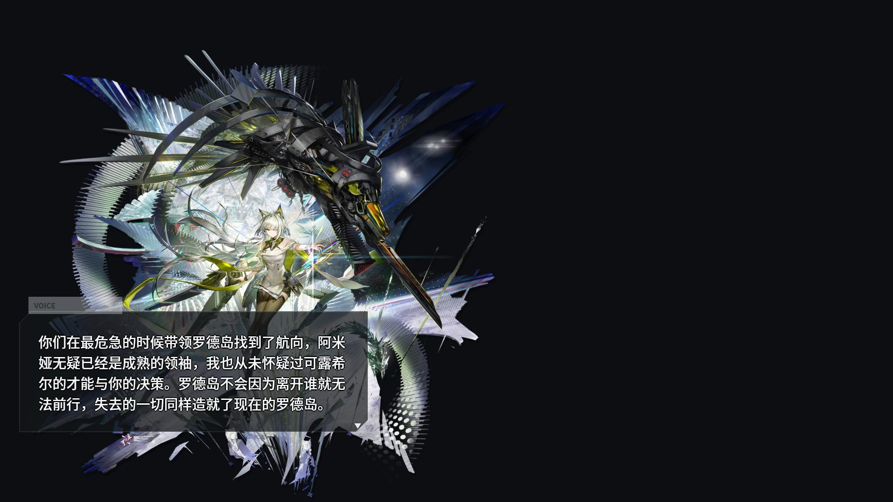
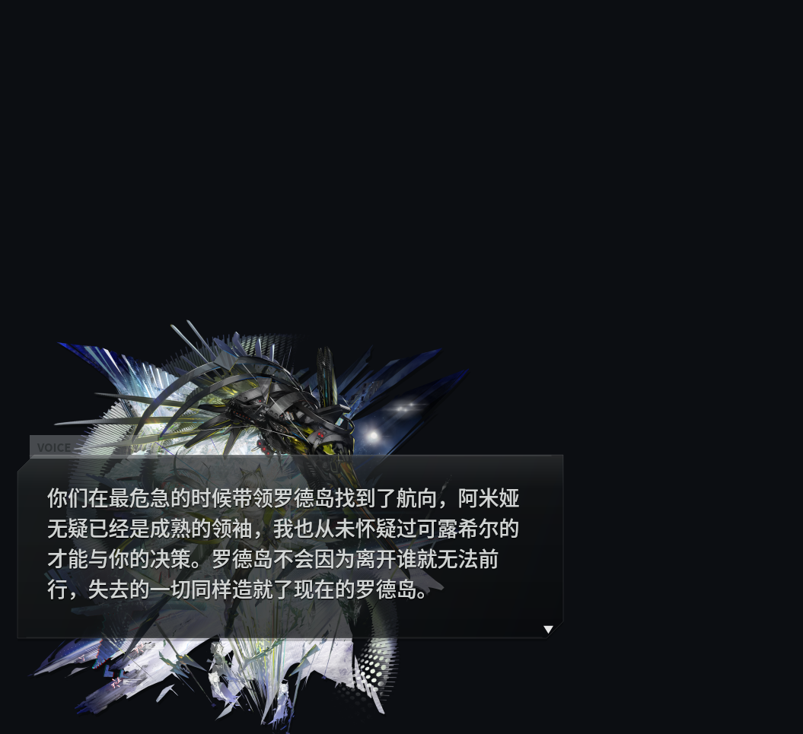

# 明日方舟主界面语音浮层


一个用 PySide6 写的桌面浮层脚本，用来模拟《明日方舟》主界面助理点击后出现的 `VOICE` 语音气泡。项目会显示现有立绘，播放匹配语音，并在左下角显示半透明语音字幕框。

> 版权提示：本项目是非商业粉丝项目。仓库内游戏立绘、语音、台词等素材的权利归鹰角网络及其关联方所有；PRTS 仅作为素材来源记录。本项目不对这些素材授予任何再授权，也不构成法律建议。公开仓库不代表素材获得了开源许可，非商业用途也不自动等于没有版权风险。

## 目录

- [项目效果](#项目效果)
- [功能特性](#功能特性)
- [环境要求](#环境要求)
- [快速开始](#快速开始)
- [配置文件说明](#配置文件说明)
- [命令行参数](#命令行参数)
- [预览图生成](#预览图生成)
- [许可证与素材边界](#许可证与素材边界)
- [素材来源](#素材来源)
- [常见问题](#常见问题)
- [开发者文档](#开发者文档)

<a id="项目效果"></a>
## 项目效果

主程序会在屏幕上显示处理后的现有人物立绘，并在左下方渲染接近游戏主界面的 `VOICE` 半透明语音气泡。气泡支持：

- 语音播放结束后自动退出
- 立绘滑入 / 滑出
- 气泡淡入 / 淡出
- 打字机文字效果
- 长文本自动缩字号
- 文本裁剪在气泡内部，避免越界

示例预览：



小尺寸窗口验证：



<a id="功能特性"></a>
## 功能特性

| 功能 | 说明 |
| --- | --- |
| 透明置顶浮层 | 使用 PySide6 创建无边框、置顶、透明背景窗口。 |
| 现有人物图 | 保留仓库已有 `1.png`、`2.png` 和 `processed_png/` 里的处理后立绘。 |
| 随机语音模式 | `config.py` 从多条主页语音中随机选择一条播放。 |
| 问候语音模式 | `start.py` 只播放“问候”语音。 |
| 语音字幕绑定 | 每个 `voices` 项同时包含 `audio` 和 `text`，避免字幕和音频错配。 |
| 长文本适配 | 用 `QTextDocument` 测量文本高度，按气泡空间自动缩字号。 |
| 离线预览 | 使用 `--preview` 渲染 PNG，不需要打开真实浮层。 |

<a id="环境要求"></a>
## 环境要求

建议环境：

- Linux 桌面环境
- Wayland 会话
- Python 3.11 或更高版本
- PySide6
- Pillow

安装依赖：

```bash
python -m venv .venv
source .venv/bin/activate
pip install PySide6 Pillow
```

> 说明：脚本默认设置了 `QT_QPA_PLATFORM=wayland` 和 `QT_WAYLAND_SHELL_INTEGRATION=layer-shell`。如果你使用 X11 或其他桌面环境，可能需要按本机环境调整 Qt 平台变量。

<a id="快速开始"></a>
## 快速开始

### 运行随机语音

`config.py` 会随机选择一张处理后立绘，并随机选择 8 条主页相关语音之一。

```bash
python main.py config.py
```

### 运行问候语音

`start.py` 只播放“问候”语音，适合绑定到启动脚本、快捷键或桌面事件。

```bash
python main.py start.py
```

### 临时指定字幕

```bash
python main.py config.py \
  --speaker 凯尔希·思衡托 \
  --line "Dr.，我在。" \
  --side left
```

### 不显示气泡

```bash
python main.py config.py --no-dialog
```

<a id="配置文件说明"></a>
## 配置文件说明

### `config.py`

随机模式。当前每张立绘都绑定 8 条凯尔希·思衡托中文主页语音：

- 任命助理
- 交谈1
- 交谈2
- 交谈3
- 闲置
- 戳一下
- 信赖触摸
- 问候

### `start.py`

问候模式。当前每张立绘都只绑定 1 条语音：

- 问候

### 推荐配置结构

```python
myconfig = {
    "processed_png/2_3_cropped.png": {
        "speaker": "凯尔希·思衡托",
        "side": "left",
        "voices": [
            {
                "title": "交谈2",
                "audio": "assets/voices/char_1052_kalts2/cn_003.mp3",
                "text": "你们在最危急的时候带领罗德岛找到了航向...",
            },
        ],
    },
}
```

### 字段说明

| 字段 | 类型 | 说明 |
| --- | --- | --- |
| `myconfig` | `dict` | 必须存在的顶层配置。key 是图片路径，value 是该图片对应的配置。 |
| `speaker` | `str` | 说话人元数据。当前 UI 不显示姓名，但可用于后续扩展。 |
| `side` | `"left"` / `"right"` | 立绘滑入方向和停靠侧。 |
| `voices` | `list[dict]` | 候选语音列表。 |
| `title` | `str` | 语音标题，如“交谈2”。 |
| `audio` | `str` | 本地音频路径，支持相对路径。 |
| `text` | `str` | 气泡内显示的字幕文本。 |

路径解析规则：

- 绝对路径直接使用。
- 相对路径以配置文件所在目录为基准解析。
- 音频文件不存在时，该语音项会被跳过。
- 图片文件不存在时，该图片项会被跳过。

<a id="命令行参数"></a>
## 命令行参数

基础格式：

```bash
python main.py [config] [options]
```

常用参数：

| 参数 | 示例 | 说明 |
| --- | --- | --- |
| `config` | `config.py` | 配置文件路径。省略时默认使用 `config.py`。 |
| `--volume` | `--volume 0.8` | 音量，范围 `0.0` 到 `1.0`。 |
| `--anim-ms` | `--anim-ms 450` | 立绘滑入 / 滑出动画时长，单位毫秒。 |
| `--typing-cps` | `--typing-cps 36` | 打字速度，单位为每秒字符数。设为 `0` 时立即显示全文。 |
| `--hold-ms` | `--hold-ms 1600` | 音频结束后额外停留时间，单位毫秒。 |
| `--side` | `--side left` | 强制立绘从左侧或右侧出现。 |
| `--line` | `--line "Dr.，我在。"` | 临时覆盖字幕。可重复传入，程序会随机选一条。 |
| `--speaker` | `--speaker 凯尔希·思衡托` | 临时覆盖说话人元数据。 |
| `--no-dialog` | `--no-dialog` | 不显示语音气泡，只显示立绘并播放语音。 |
| `--background` | `--background bg.png` | 可选背景图。 |
| `--preview` | `--preview out.png` | 渲染预览图，不打开真实浮层。 |
| `--preview-size` | `--preview-size 1600x900` | 预览图尺寸。 |

<a id="预览图生成"></a>
## 预览图生成

调 UI 时建议先用预览模式，避免反复打开真实桌面浮层。

常规 16:9 预览：

```bash
QT_QPA_PLATFORM=offscreen python main.py config.py \
  --preview previews/home_voice_bubble.png \
  --preview-size 1600x900 \
  --typing-cps 0
```

小窗口长台词验证：

```bash
QT_QPA_PLATFORM=offscreen python main.py config.py \
  --preview previews/home_voice_bubble_small.png \
  --preview-size 1055x965 \
  --typing-cps 0 \
  --line "你们在最危急的时候带领罗德岛找到了航向，阿米娅无疑已经是成熟的领袖，我也从未怀疑过可露希尔的才能与你的决策。罗德岛不会因为离开谁就无法前行，失去的一切同样造就了现在的罗德岛。"
```

<a id="许可证与素材边界"></a>
## 许可证与素材边界

本仓库使用分离授权：

- 本项目自有 Python 代码使用 `AGPL-3.0-only`。
- 完整许可证正文：[LICENSES/AGPL-3.0-only.txt](LICENSES/AGPL-3.0-only.txt)。
- 适用范围说明：[LICENSE.md](LICENSE.md)。
- 游戏素材和游戏内容不适用 AGPL：[ASSETS-NOTICE.md](ASSETS-NOTICE.md)。

不在 AGPL-3.0-only 覆盖范围内的内容包括：

- `1.png`、`2.png`
- `processed_png/`
- `previews/`
- `assets/voices/`
- 配置文件和文档中出现的《明日方舟》角色名、台词、语音、立绘及其他游戏衍生内容

<a id="素材来源"></a>
## 素材来源

语音来自 PRTS 的 `凯尔希·思衡托/语音记录`，下载路径和编号记录在：

- [assets/voices/char_1052_kalts2/SOURCES.md](assets/voices/char_1052_kalts2/SOURCES.md)

当前语音目录：

```text
assets/voices/char_1052_kalts2/
├── cn_001.mp3
├── cn_002.mp3
├── cn_003.mp3
├── cn_004.mp3
├── cn_010.mp3
├── cn_034.mp3
├── cn_036.mp3
├── cn_042.mp3
└── SOURCES.md
```

公开维护注意事项：

- 不要声称游戏素材是开源素材。
- 不要把素材重新授权给他人。
- 如权利方要求移除素材，应及时处理。
- 如果你要做可商用项目，应替换为自己拥有授权的素材。

<a id="常见问题"></a>
## 常见问题

### 启动后没有窗口

程序会用 `/tmp/alpha-floating-widget.lock` 防止重复运行。如果已有实例在运行，新的进程会直接退出。

### 没有声音

请检查：

- 音频文件是否存在。
- 系统音频输出是否正常。
- 是否传入了 `--volume 0`。
- Qt Multimedia 是否能在当前环境播放 mp3。

### Wayland 下不显示

默认环境变量：

```python
QT_QPA_PLATFORM=wayland
QT_WAYLAND_SHELL_INTEGRATION=layer-shell
```

不同桌面环境支持程度不同。如果不显示，可以尝试改为适合你桌面的 Qt 平台插件。

### 预览失败

使用 offscreen 平台：

```bash
QT_QPA_PLATFORM=offscreen python main.py config.py --preview out.png
```

### 字幕仍然太长

当前实现会自动缩字号并裁剪在气泡内部。如果你希望更接近游戏效果，建议直接缩短 `text`，因为游戏主页气泡本身也不是为超长段落设计的。

<a id="开发者文档"></a>
## 开发者文档

- [中文开发文档](docs/DEVELOPMENT.zh-CN.md)
- [English Development Guide](docs/DEVELOPMENT.en.md)

语言入口：

- [English README](README.en.md)
- [根 README](README.md)
